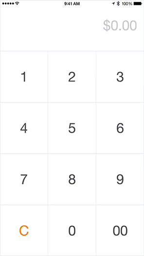

# NumPad

[](http://twitter.com/lasha_)
[](http://cocoapods.org/pods/NumPad)
[](https://travis-ci.org/efremidze/NumPad)
[](https://codebeat.co/projects/github-com-efremidze-numpad)

Number Pad inspired by [Square](https://square.com). This module is based on [LEAmountInputView](https://github.com/efremidze/LEAmountInputView).



```
$ pod try NumPad
```

## Installation
###CocoaPods
To install with [CocoaPods](http://cocoapods.org/), simply add this in your `Podfile`:
```ruby
use_frameworks!
pod "NumPad"
```

###Carthage
To install with [Carthage](https://github.com/Carthage/Carthage), simply add this in your `Cartfile`:
```ruby
github "efremidze/NumPad"
```

## Usage

At first, import NumPad library:

```swift
import NumPad
```

Then just create your `NumPad`:

```swift
let numPad = NumPad()
numPad.rows = 4
numPad.columns = { _ in 3 }
numPad.item = { [unowned numPad] position in
    var item = Item()
    item.title = {
        switch (position.row, position.column) {
        case (3, 0):
            return "C"
        case (3, 1):
            return "0"
        case (3, 2):
            return "00"
        default:
            var index = (0..<position.row).map { numPad.columns($0) }.reduce(0, combine: +)
            index += position.column
            return "\(index + 1)"
        }
    }()
    item.titleColor = {
        switch (position.row, position.column) {
        case (3, 0):
            return .orangeColor()
        default:
            return UIColor(white: 0.3, alpha: 1)
        }
    }()
    item.titleFont = .systemFontOfSize(40)
    return item
}
addSubview(numPad)
```

Or use the `DefaultNumPad` for a standard NumPad:

```swift
let numPad = DefaultNumPad()
addSubview(numPad)
```

### Customization
```swift
var rows: Int // number of rows
var columns: (Row -> Int) // number of columns for row
var item: (Position -> Item) // item for position
var itemSize: (Position -> CGSize)? // item size for position
var itemTapped: ((Item, Position) -> Void)? // handle item tap
```

## Contributions

Contributions are totally welcome.

## License

NumPad is available under the MIT license. See the LICENSE file for more info.
