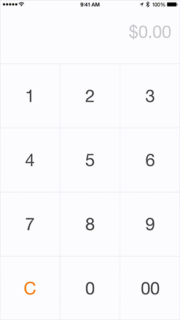

# NumPad

[](http://twitter.com/lasha_)
[](https://cocoapods.org/pods/NumPad)
[](http://cocoapods.org/pods/NumPad)
[](https://travis-ci.org/efremidze/NumPad)

## Overview

`NumPad` is a number pad inspired by Square's design.



```
$ pod try NumPad
```

## Requirements
* iOS 7.0+
* Swift 2.2
* Xcode 7

## Installation

NumPad is available through [CocoaPods](http://cocoapods.org). To install
it, simply add the following line to your Podfile:

```ruby
use_frameworks!
pod 'NumPad'
```

## Usage

```swift
let numPad = NumPad()
numPad.dataSource = self
numPad.delegate = self
addSubview(numPad)

// NumPadDataSource
func numberOfRowsInNumberPad(numPad: NumPad) -> Int {
    return 4
}

func numPad(numPad: NumPad, numberOfColumnsInRow row: Int) -> Int {
    return 3
}

// NumPadDelegate
func numPad(numPad: NumPad, willDisplayButton button: UIButton, forPosition position: Position) {
    let index = numPad.indexForPosition(position)
    button.setTitle("\(index + 1)", forState: .Normal)
}

func numPad(numPad: NumPad, buttonTappedAtPosition position: Position) {
    // handle tap
}

```

See the `NumPadDemo` project for example usage.

## Contributions

Contributions are totally welcome.

## License

NumPad is available under the MIT license. See the LICENSE file for more info.
